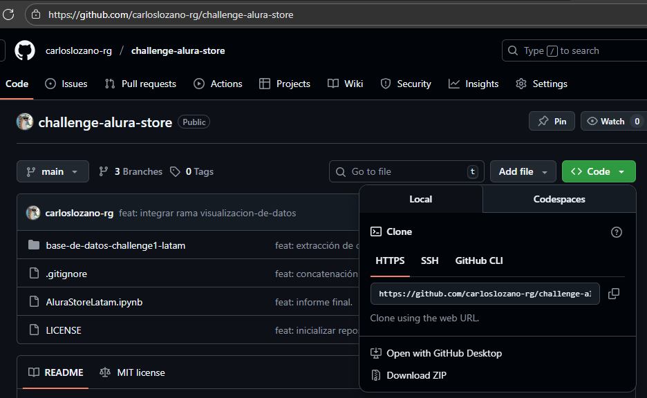

# Challenge Alura Store
Este repositorio representa el Primer Challenge de la Segunda Fase del programa Oracle Next Education, especialidad Data Science impartido por Oracle y Alura Latam.

## Índice
- [Descripción del Proyecto](#descripción-del-proyecto)
- [Comenzando](#comenzando)
    - [Pre-Requisitos](#pre-requisitos)
    - [Instalación](#instalación)
- [Tecnologías utilizadas](#tecnologías-utilizadas)
- [Estado del proyecto](#estado-del-proyecto)
- [Acceso al Proyecto](#acceso-al-proyecto)
- [Licencia](#licencia)
- [Personas Desarrolladoras del Proyecto](#personas-desarrolladoras-del-proyecto)

## Descripción del Proyecto
El proyecto propone una situación ficticia donde tenemos que ayudar al Sr. Juan a decidir qué tienda de su cadena Alura Store debe vender para iniciar un nuevo emprendimiento. 

Para ello, se analizaran datos de ventas, rendimiento y reseñas de las 4 tiendas de Alura Store. 

El objetivo es identificar la tienda menos eficiente y presentar una recomendación final basada en los datos.

El **flujo de trabajo** se baso en el Trello proporcionado por Alura: <https://trello.com/b/38g2ykhd/alura-store-latam>, por lo que se puede llegar un resultado similar a la libreta **'AluraStoreLatam.ipynb'** siguiendo dicho flujo.

## Comenzando

### Pre-Requisitos
- Puedes elegir cualquier editor de código fuente para trabajar con este repositorio.
Mi recomendación es usar **Visual Studio Code**.
- Python 3+.

### Instalación

Para obtener una copia de este reposirorio puedes:

1. Dirigirte a la url donde se encuentra alojado el [repositorio](https://github.com/carloslozano-rg/challenge-alura-store) y decargarlo como archivo comprimido zip seleccionando el botón verde 'Code' y después 'Download ZIP'. 

2. Dirigirte a tu carpeta local donde quieres alojar el repositorio y usa el siguiente comando en tu terminal: 

    ```
    git clone https://github.com/carloslozano-rg/challenge-alura-store
    ```

Para instalar las librerías necesarias para trabajar con el repositorio, ejecuta este comando en tu terminal:

```
pip install -r requirements.txt
```

## Tecnologías utilizadas
- Editor de código:
**Visual Studio Code**
- Lenguaje de programación: **Python**
    - Pandas
    - Matplotlib
    - Jupyter


## Estado del Proyecto
Finalizado.

## Acceso al Proyecto
- Repositorio: <https://github.com/carloslozano-rg/challenge-alura-store.git>

## Licencia
**MIT License**

## Personas Desarrolladoras del Proyecto
Carlos Lozano:
* **GitHub:** <https://github.com/carloslozano-rg>
* **Correo:** clozanoguadarrama@gmail.com
* **LinkedIn:** <https://www.linkedin.com/in/lozano-guadarrama>
